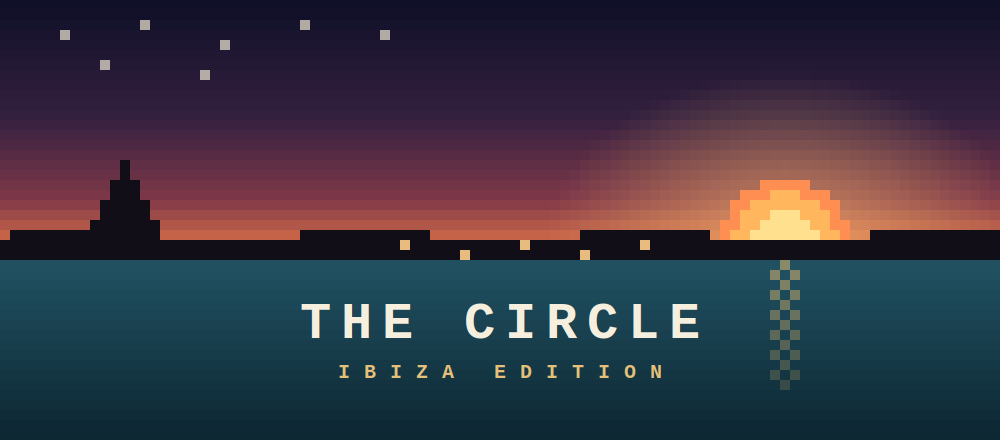

<p align="center">
  
</p>

# Ibiza Inner Circle · Samar Brain

Your own cloud machine with **Claude Code** already installed, wired into the **Samar Brain** —
top operators' entire playbooks turned into an AI you can build with.

You don't prompt a blank AI. You build on top of operators who've already done it.

## See the brain live

**🧠 [brain.thecirclebrain.com](https://brain.thecirclebrain.com)** — explore the knowledge graph and
ask it anything, right in your browser. Password: **`ibiza`**

## Quick Start (One-Click!)

[](https://codespaces.new/phc-global/Ibiza-Inner-Circle)

1. Click the button. Wait for the environment to build (a couple of minutes the first time —
   it's installing Node, Python, and a full toolchain).
2. In the terminal, log in to Claude — run `claude` and follow the quick sign-in with your
   Claude account (Pro or Max):

   ```
   claude
   ```

3. Once you're signed in, restart it in **build mode** (skips the "can I do this?" prompts so
   it just builds — safe here because this is a throwaway cloud sandbox):

   ```
   claude --dangerously-skip-permissions
   ```

4. Paste one of the prompts below and watch it work.

## Prompts to try (copy-paste these)

**Build a VSL landing page from the brain**
```
Use the samar-brain skill. Show me several different high-converting opt-in and VSL funnels
the instructor has broken down or roasted — pull the actual page frames — then design a forex
trading-bot VSL landing page that applies the best structural patterns from them.
```

**Build the SMS follow-up funnel**
```
Use the samar-brain skill. Ask it for the exact SMS flows for an ecom dropout funnel — how
many messages, the sequence, the timing, the triggers, the actual message copy, and the tools
they use to lift response rates — pull any reference frames it has, then write the full build
spec to builds/sms-funnel/BUILD.md.
```

Claude asks the brain, gets the expert playbook **plus the actual reference frames**, and then
**builds the real files** in `builds/`. Open the preview to see landing pages live.

## How it works

- **The brain runs on a server.** You can't download it — you only get answers.
- **Claude Code is the hands.** It takes the brain's guidance and builds the real thing here.

Ask it anything you'd ask a top operator. Then watch it build.

---

**Ibiza Inner Circle** — hosted by Samar Hussain
